🏏 IPL Score & Winner Prediction

📌 Project Description
This project is a Machine Learning-based web application that predicts the final score of IPL teams and determines the likely match winner. It uses historical ball-by-ball IPL data to analyze match situations, player performance, and team strength.
The system allows users to select teams and players, view insights, and generate predictions along with explanations. It demonstrates how data-driven techniques can be applied to sports analytics for better decision-making and fan engagement.

📊 Dataset
This project uses the IPL dataset from Kaggle:
https://www.kaggle.com/datasets/patrickb1912/ipl-complete-dataset-20082020?select=deliveries.csv

Dataset used:
- deliveries.csv

Why deliveries.csv?
It contains ball-by-ball data including:
- Runs scored
- Wickets
- Players
- Over and ball details

This helps derive:
- Run rate
- Batting strength
- Bowling strength
- Match context

🚀 Features
- Select 2 IPL teams
- Choose 11 players for each team
- View team head-to-head insights
- View player performance stats
- Predict:
  - Final score
  - Match winner
  - Winning margin
  - Reason for prediction

🧠 Machine Learning

Models used:
- Linear Regression
- Random Forest
- Gradient Boosting (Best Model)
- Neural Network (MLP Regressor)

Model Selection:
- Compared using MAE, RMSE, and R²
- Best model selected automatically
- Hyperparameter tuning using RandomizedSearchCV

⚙️ Technology Used

Programming & Libraries:
- Python
- Pandas
- NumPy
- Matplotlib
- Scikit-learn
- Joblib

Machine Learning:
- Regression Models
- Ensemble Learning
- Neural Network (MLP Regressor)

Web Development:
- Flask
- HTML
- CSS

📂 Modules Implemented

1. Data Preprocessing Module
- Cleans dataset and handles missing values
- Maps team names and filters valid teams

2. Feature Engineering Module
- Calculates batting strength, bowling economy, run rate
- Extracts match-level features from ball-by-ball data

3. EDA Module (eda.py)
- Analyzes score distribution
- Visualizes team performance and trends

4. Model Training Module (train_model.py)
- Trains multiple ML models
- Evaluates using MAE, RMSE, R²
- Selects best model automatically

5. Dataset Preparation Module (prepare_dataset.py)
- Converts raw data into ML-ready dataset
- Generates ipl_ml_dataset.csv

6. Web Application Module (app.py)
- Provides user interface
- Handles input and prediction
- Displays results and insights

📂 Project Structure

IPL-Predictor/
│
├── app.py
├── eda.py
├── prepare_dataset.py
├── train_model.py
├── model_pipeline.pkl
├── deliveries.csv
├── requirements.txt
├── screenshots/
│   ├── home.png
│   ├── players.png
│   ├── insights.png
│   ├── result.png
├── eda/
│   ├── eda_1_score_distribution.png
│   ├── eda_2_team_average_score.png
│   ├── eda_3_powerplay_runs.png
│   ├── eda_4_death_overs_runs.png
│   ├── eda_5_wickets_vs_score.png
│   ├── eda_6_run_rate_vs_score.png
│   ├── eda_7_top_batters.png
│   ├── eda_8_top_bowlers.png
│   ├── eda_9_boundaries_by_team.png
└── README.md

⚙️ Installation & Setup

1. Clone repository
git clone https://github.com/shivadharshan17/IPL-Predictor.git
cd IPL-Predictor

2. Install dependencies
pip install -r requirements.txt

3. Download dataset
Download deliveries.csv from Kaggle and place it in project folder

4. Prepare dataset
python prepare_dataset.py
Creates: ipl_ml_dataset.csv

5. Run EDA
python eda.py

6. Train model
python train_model.py
This will:
- Train multiple models
- Select best model
- Apply tuning
- Save model_pipeline.pkl

7. Run application
python app.py

🖥️ How to Use
- Select Team 1 and Team 2
- View team insights
- Select 11 players for each team
- View player statistics
- Click Predict Winner
- View results and explanation

📸 Application Screenshots

Below are the sample outputs of the IPL Score Prediction system.

🔹 Home Page
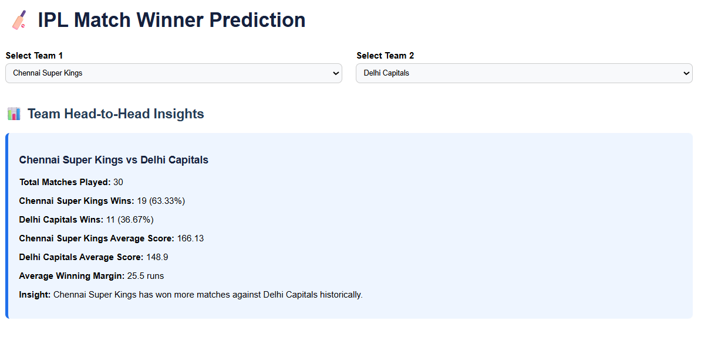

🔹 Select Playing XI
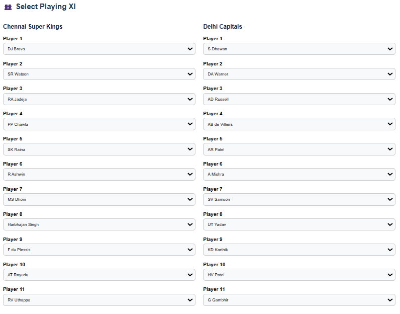

🔹 Team Insights
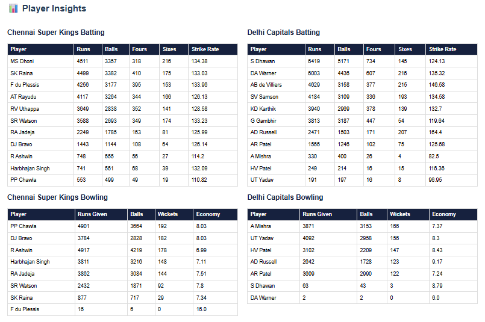

🔹 Prediction Result
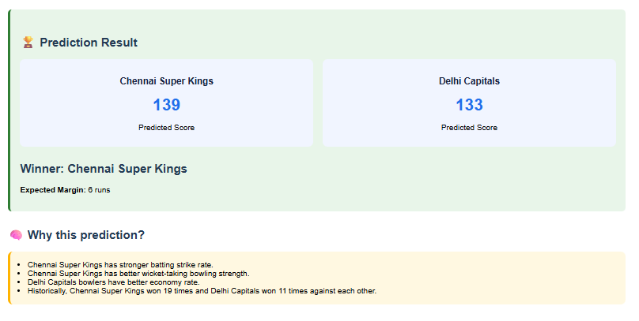

📊 Exploratory Data Analysis (EDA)

🔹 Score Distribution
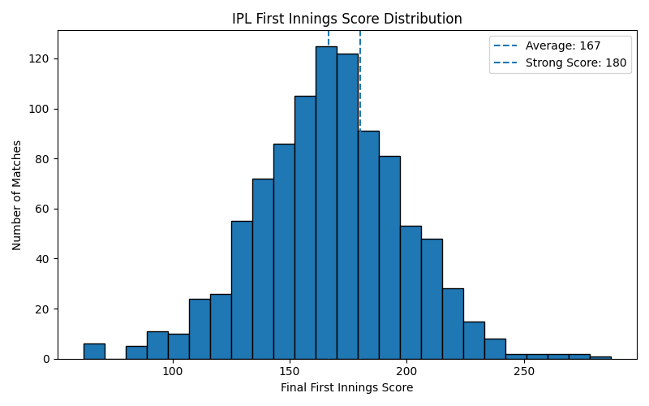

🔹 Team Average Score
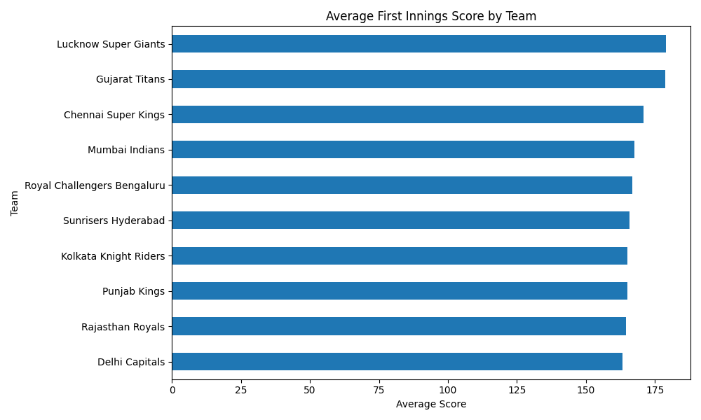

🔹 Powerplay Runs
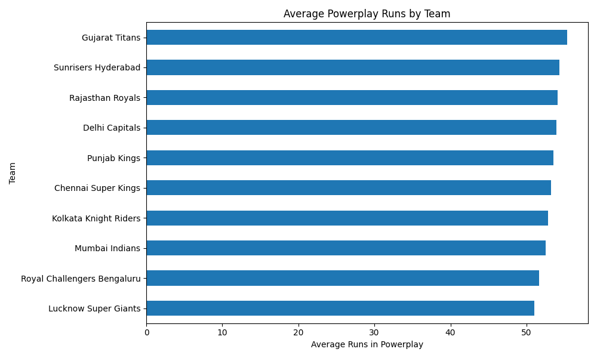

🔹 Death Overs Runs
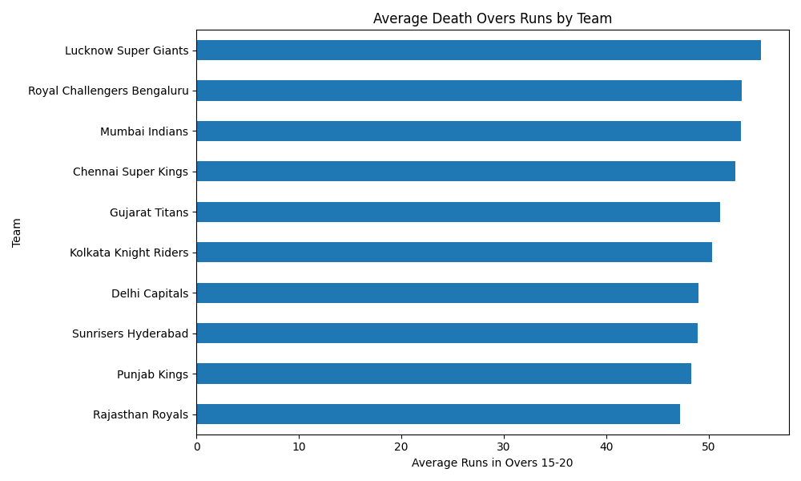

🔹 Wickets vs Score
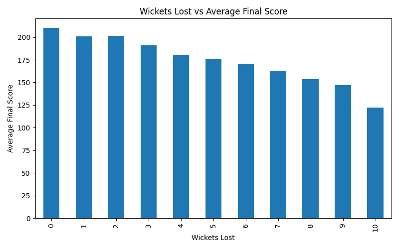

🔹 Run Rate vs Score
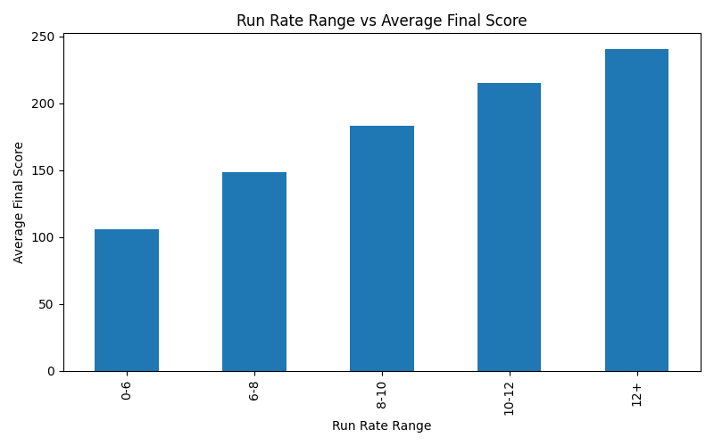

🔹 Top Batters
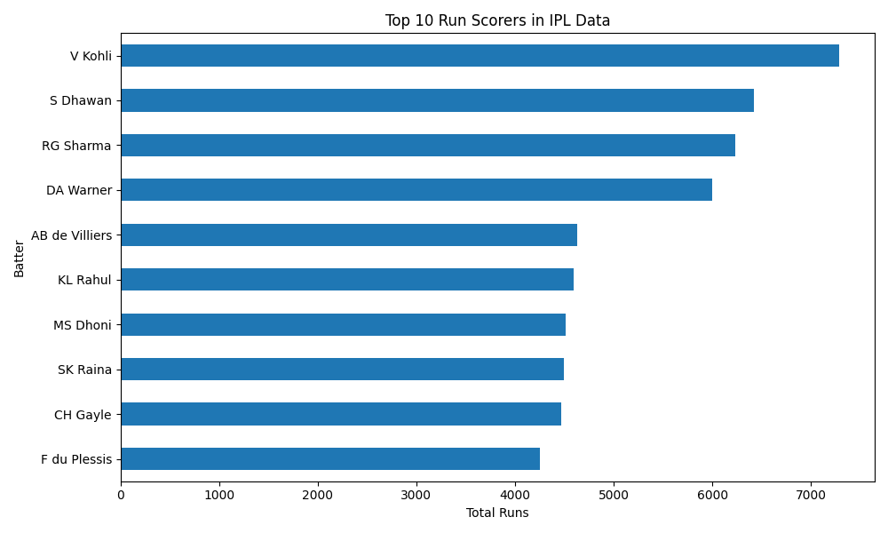

🔹 Top Bowlers
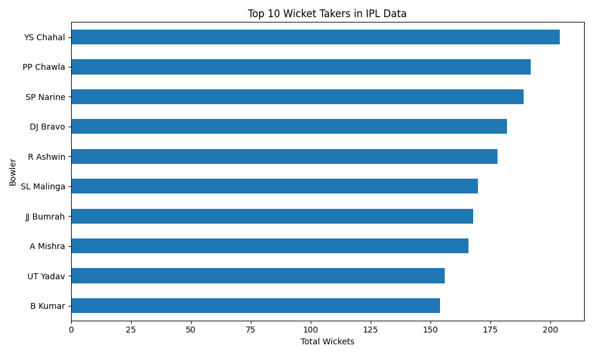

🔹 Boundaries by Team
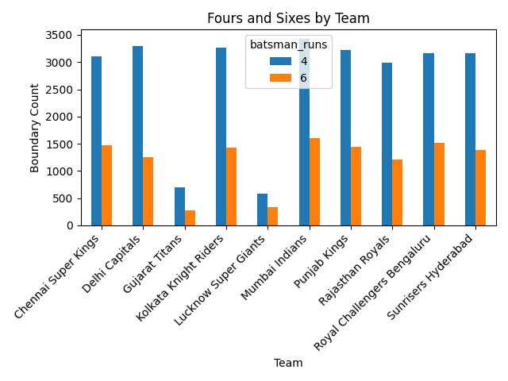

📊 Key Features Used
- Batting strength (strike rate)
- Boundary strength (4s & 6s)
- Bowling economy
- Wicket-taking ability
- Run rate
- Wickets lost

⚠️ Notes
- Dataset must be downloaded manually
- Model is generated after training
- Results depend on selected players
